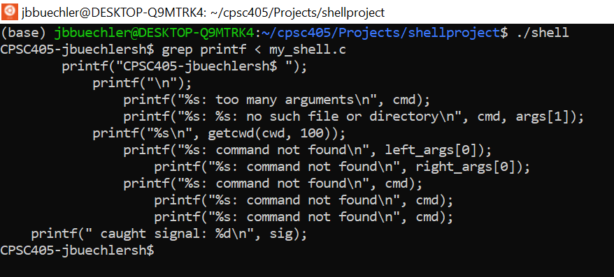

**This repository contains a basic shell program native to Linux operating system
that supports various functionalities, all of which are detailed and demonstrated
in the test cases below!**

**The sequence diagram above describes how the shell functions; a user command is 
first entered and parsed. If the command is internal (defined and supported
by my shell code - *cd*/*pwd*/etc), it is simply executed by the shell - the parent process. 
If the command is external (native linux command - *grep*/*cat*/etc), the *fork()* system
call is used to duplicate the shell process and create an identical child process. The child
process then makes another system call, *execvp()*, which overwrites the child to execute
the external command.**

**TEST CASES:**

**Execution of external command *cat* using *fork()* and *execvp()*.**

**Processing internal commands *cd* (change directory) and *pwd* (print working directory).**

**Input redirection (<) - grep command source of input redirected to my_shell.c
file, resulting in a search for all instances of the text *printf* within the specified file.**

**Output redirection**

